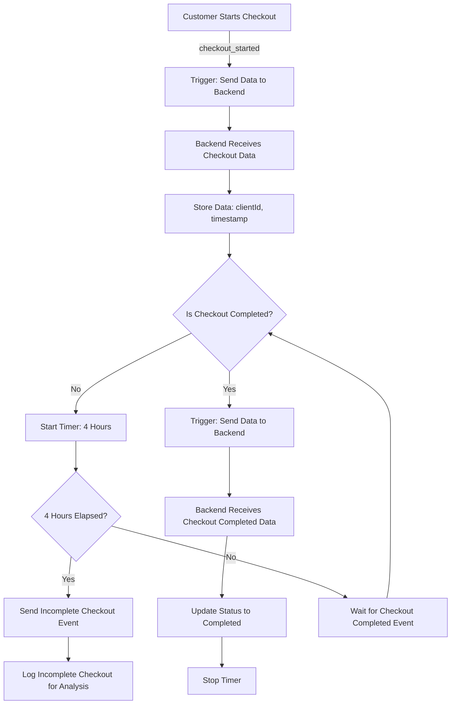

Certainly! Here's a mermaid diagram representing the workflow for your app's backend that tracks customer checkout data and sends an event if the checkout is not completed within 4 hours.

### Mermaid Diagram:

### Explanation:

1. **Customer Starts Checkout**:

   - When a customer starts the checkout process, an event `checkout_started` is triggered and data (including `clientId` and `timestamp`) is sent to your backend.

2. **Backend Receives Checkout Data**:

   - The backend receives the `checkout_started` event and stores the `clientId` and `timestamp` in a database.

3. **Check if Checkout is Completed**:

   - The backend checks if a `checkout_completed` event is received for the same `clientId`.

4. **Start Timer**:

   - If the checkout is not completed, a timer is started for 4 hours.

5. **4 Hours Elapsed?**:

   - The backend checks if 4 hours have elapsed since the checkout started.

6. **Send Incomplete Checkout Event**:

   - If the checkout is not completed within 4 hours, an incomplete checkout event is sent (e.g., email reminder, notification, etc.).

7. **Log for Analysis**:

   - The backend logs this incomplete checkout for further analysis or actions.

8. **If Checkout is Completed**:

   - If the checkout is completed, the backend receives the `checkout_completed` event, updates the status to completed, and stops the timer if it's still running.

9. **Wait for Event**:
   - The backend continues to wait for the `checkout_completed` event if the timer has not yet reached 4 hours.

This diagram should help you visualize the flow and interactions within your system as you develop the backend module. Let me know if you need further details or adjustments!
